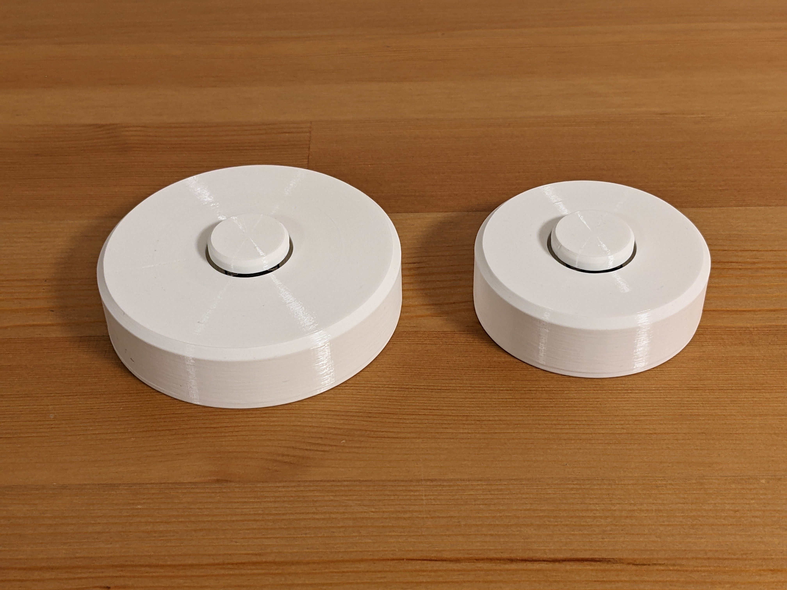
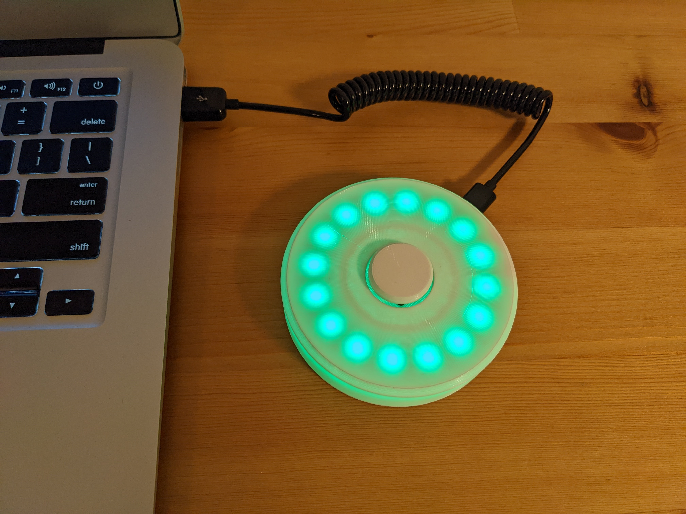
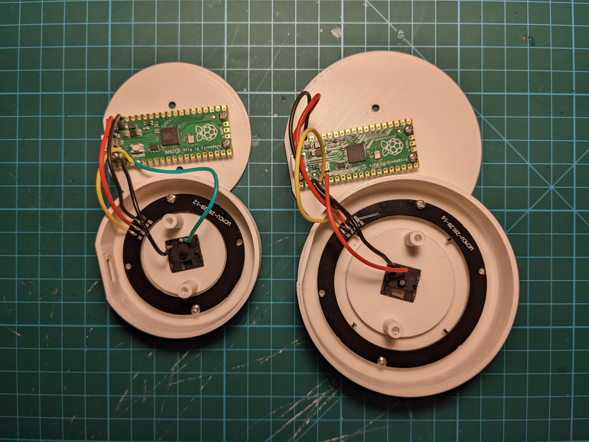

# Mute button/status indicator for Google Meet

This is a USB mute button/call status indicator for Google Meet. It has LEDs that light up when you join a meeting and turn red when your mic is muted. Here's a [blog post](https://workspaceupdates.googleblog.com/2022/08/google-meet-call-control-usb-peripheral-devices.html) from Google that introduces the concept and shows how to configure the device in Google Meet settings.

And here's [a video](https://www.youtube.com/watch?v=Z7VTwXMVH2g) showing the device in action.

It uses the following components:

* Raspberry Pi Pico
* either a 12x or 16x WS2812 LED ring, depending on which size you want (available on AliExpress)
* Kailh low-profile (choc v1) mechanical keyboard switch
* [3D-printed parts](3d-printed-parts) (print in white so that the LEDs shine through)
* M3x4 flat head and M2x4 screws

Wire the DI pad on the LED ring to GPIO2 on the Pico and the keyboard switch to GPIO3 and GND. Also wire 5V and GND pads on the ring to VBUS and GND on the Pico.

To flash the Pico with the firmware, hold the BOOTSEL button while connecting it to the computer and copy the [mute\_button.uf2](mute_button.uf2) file to the drive that shows up.





## How to compile the code

```
git clone https://github.com/jfedor2/meet-mute-button.git
cd meet-mute-button
git submodule update --init
cd code
mkdir build
cd build
cmake ..
make
```

## Acknowledgements

`ws2812.cc` and `ws2818.pio` files are derived from [Pico SDK examples](https://github.com/raspberrypi/pico-examples). They come with the following license:

```
Copyright 2020 (c) 2020 Raspberry Pi (Trading) Ltd.

Redistribution and use in source and binary forms, with or without modification, are permitted provided that the
following conditions are met:

1. Redistributions of source code must retain the above copyright notice, this list of conditions and the following
   disclaimer.

2. Redistributions in binary form must reproduce the above copyright notice, this list of conditions and the following
   disclaimer in the documentation and/or other materials provided with the distribution.

3. Neither the name of the copyright holder nor the names of its contributors may be used to endorse or promote products
   derived from this software without specific prior written permission.

THIS SOFTWARE IS PROVIDED BY THE COPYRIGHT HOLDERS AND CONTRIBUTORS "AS IS" AND ANY EXPRESS OR IMPLIED WARRANTIES,
INCLUDING, BUT NOT LIMITED TO, THE IMPLIED WARRANTIES OF MERCHANTABILITY AND FITNESS FOR A PARTICULAR PURPOSE ARE
DISCLAIMED. IN NO EVENT SHALL THE COPYRIGHT HOLDER OR CONTRIBUTORS BE LIABLE FOR ANY DIRECT, INDIRECT, INCIDENTAL,
SPECIAL, EXEMPLARY, OR CONSEQUENTIAL DAMAGES (INCLUDING, BUT NOT LIMITED TO, PROCUREMENT OF SUBSTITUTE GOODS OR
SERVICES; LOSS OF USE, DATA, OR PROFITS; OR BUSINESS INTERRUPTION) HOWEVER CAUSED AND ON ANY THEORY OF LIABILITY,
WHETHER IN CONTRACT, STRICT LIABILITY, OR TORT (INCLUDING NEGLIGENCE OR OTHERWISE) ARISING IN ANY WAY OUT OF THE USE OF
THIS SOFTWARE, EVEN IF ADVISED OF THE POSSIBILITY OF SUCH DAMAGE.
```
